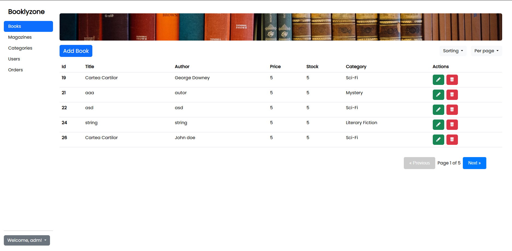

# 📚 Booklyzone Web Application

A full-stack **Bookstore Web Application** built with **ASP.NET Web API** (backend) and **Angular** (frontend), using **SQL Server** as the database.  
It supports secure user authentication using **JWT**, books and magazines browsing with advanced filtering and sorting, a **hybrid cart system**, **admin panel** and simulated order processing.

---

## 🚀 Features

### ✅ User & Auth
- 🔐 JWT-based authentication
- 👤 User registration & login
- 💾 Login state stored securely (local storage)
- ✉️ Email and form validation
- ✅ Member and Admin roles

### 🛒 Shopping & Products
- 📚 Browse books & magazines
- 🛍 **Hybrid Cart System** (local cart for guests + server cart for logged-in users)
- ➕ Add / Remove / Update cart items
- 🧾 Simulated order processing
- ✅ Create / Edit / Delete books, magazines and users
- ✅ View books and magazines details

### 🔎 Search & Filter
- 📂 Sort by category
- 🔠 Sort by name, price
- 📄 Pagination
- #️⃣ Page size options: **20 / 40 / 60**
- 🆕 Latest Books & Magazines on Home page
- ✅ Searchbar with auto complete (by title)

---

## 🧰 Tech Stack

### Backend
- ASP.NET Web API
- Entity Framework Core
- SQL Server
- JWT Authentication

### Frontend
- Angular
- Bootstrap 
- RxJS & HTTP Interceptors

---

## 🗄 Database Structure

| Table      | Description |
|------------|-------------|
| Users      | Stores user credentials |
| Books      | Stores book details |
| Magazines  | Stores magazine details |
| Orders     | Stores simulated orders |
| CartItems  | Stores hybrid cart data |

---

## Preview

Here are a few screenshots of the UI:



You can find more in the 'screenshots' folder.

## Project structure

```
Bookstore App/
|--Bookstore.Repositories/  # Data access layer
|--Bookstore.Server/        # API server
|--Bookstore.Services/      # Business Logic / service layer
|--Bookstore.client/        # Angular frontend
|--screenshots
|--.gitignore
|--README.md                # Main project introduction (you are here)

```

## 🚀 Quick Start

### 1. Clone the repository  
```bash
git clone https://github.com/andreib04/Bookstore.licenta.git
cd Bookstore.licenta
```

### 2. Open the solution file Bookstore.sln
```bash
- Bookstore.Server - ASP.NET Web API backend
- Bookstore.Services - business logic 
- Bookstore.Repositories - data access layer (Entity Framework & SQL Server)
- bookstore.client - Angular Frontend
```

### 3. Configure the database 
```bash
- Ensure you have SQL Server installed and running 
- Update the connection string in 'Bookstore.Server/appsettings.json' 
- Apply the EF migrations or manually run the SQL script to create the database schema
```

### 4. Run the backend API
```bash
cd Bookstore.Server
# (In Visual Studio: set Bookstore.Server as startup project and run)
# Or via CLI:
dotnet restore
dotnet ef database update
dotnet run
```

### 5. Run the frontend 
```bash
cd bookstore.client
npm install
ng serve
```
The Angular app should open in your browser at http://localhost:4200
 by default.

